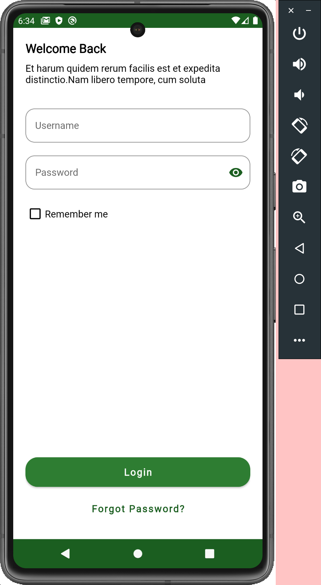
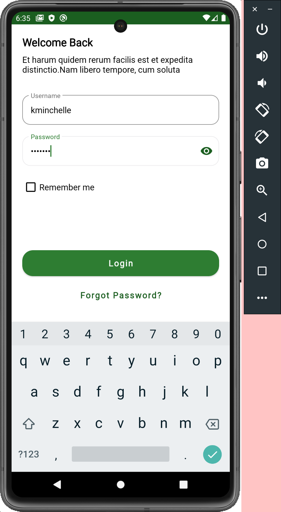
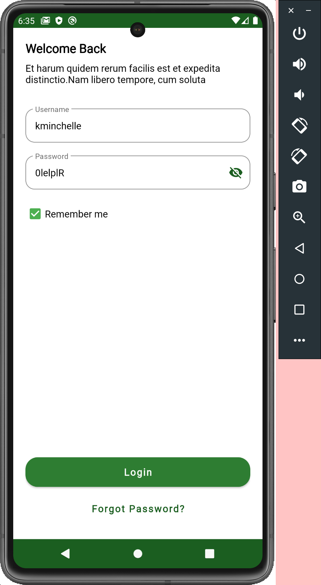
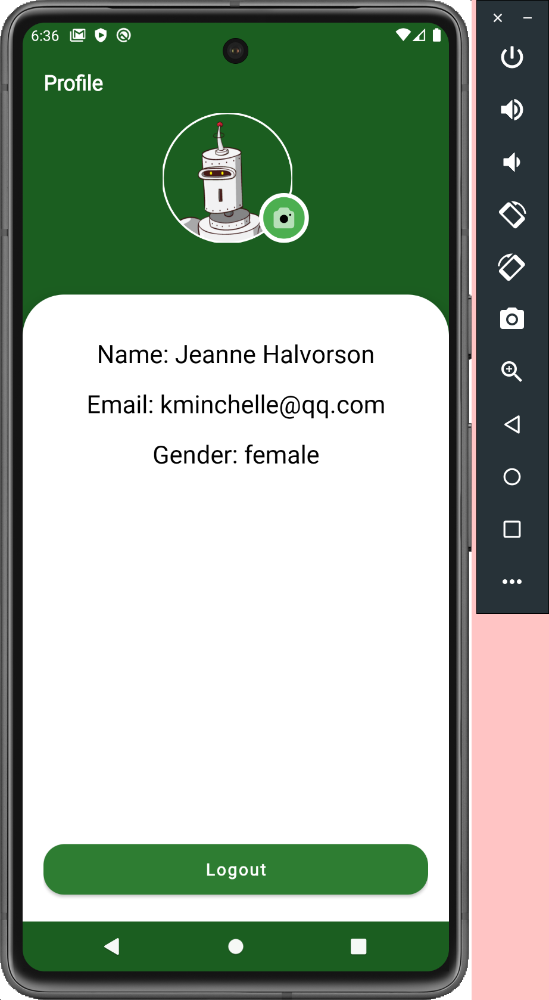
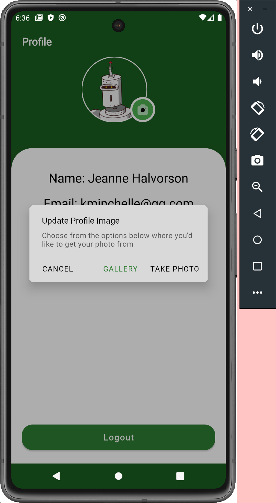
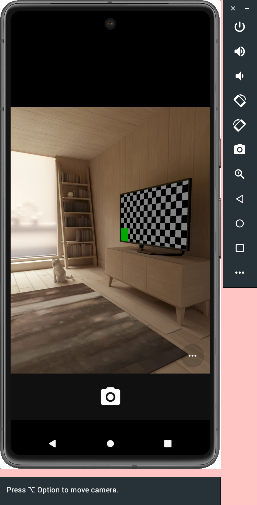
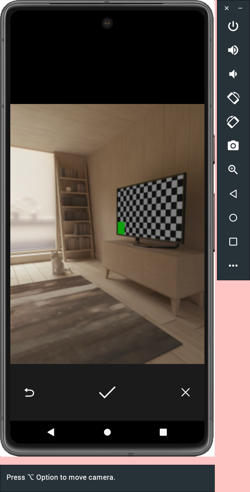
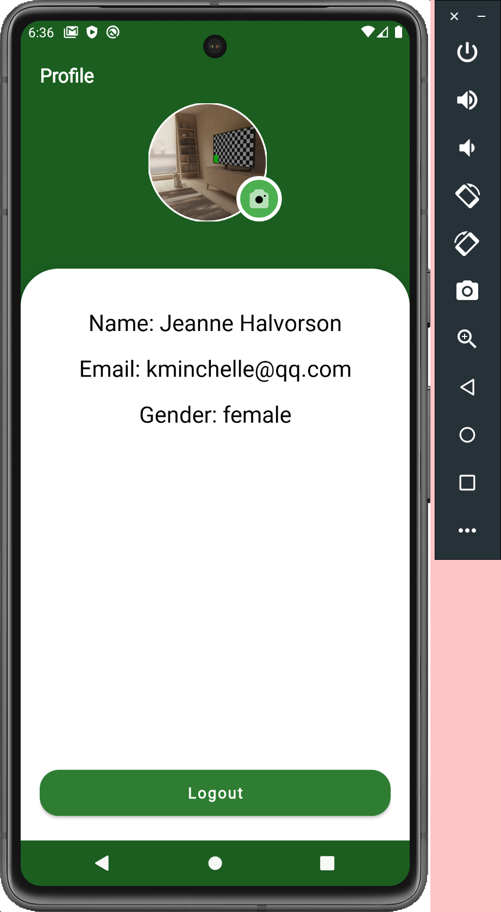

# :waxing_gibbous_moon: CodeLabTest

# :question: Tech Stack

❖ MVVM ❖ Kotlin ❖ Hilt ❖ Retrofit

# :scroll: Screenshots

  
  
  

  
  
  

  
  
  

## Run application

`./gradlew installDebug`

## Integration with test server

url: https://dummyjson.com/auth/login
username: kminchelle
password: 0lelplR

## Installation

    Follow these steps if you want to get a local copy of the project.

    Prerequisites
    Android Studio IDE 4.0+
    Android SDK v30
    Android Build Tools 30.0.0+
    1. Clone or fork the repository (Main Branch) by running the command below
    on your git terminal
    
    `git clone https://github.com/chydee/CodeLabTest.git`
    
    2. Import the project in AndroidStudio
    In Android Studio, go to File -> New -> Import project
    Follow the dialog for set up instructions

    To run this application, please use an Android device or emulator (OS 5.0 or newer).
